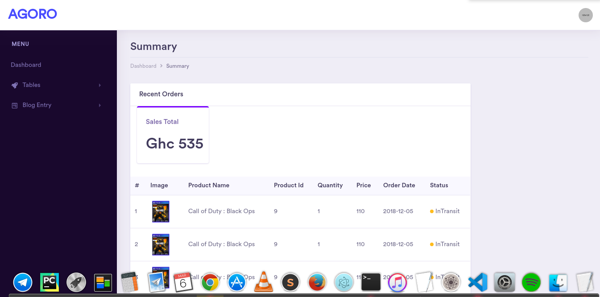
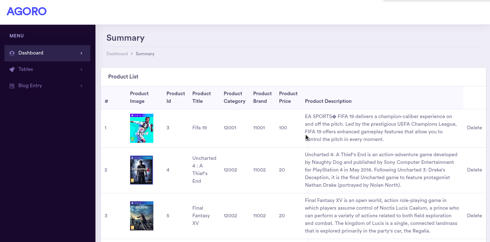
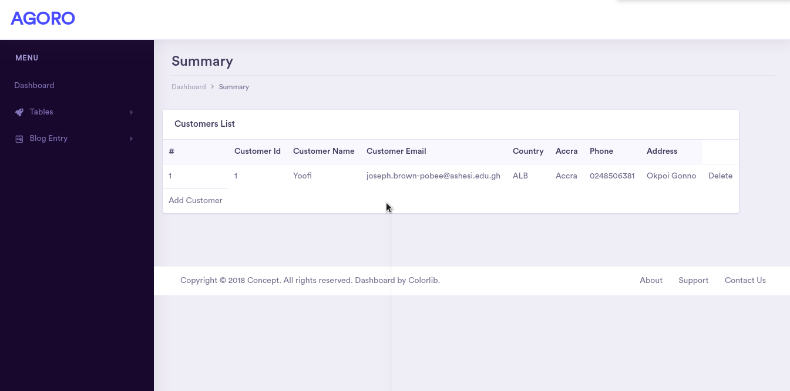
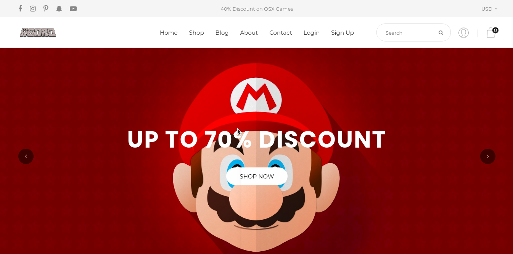
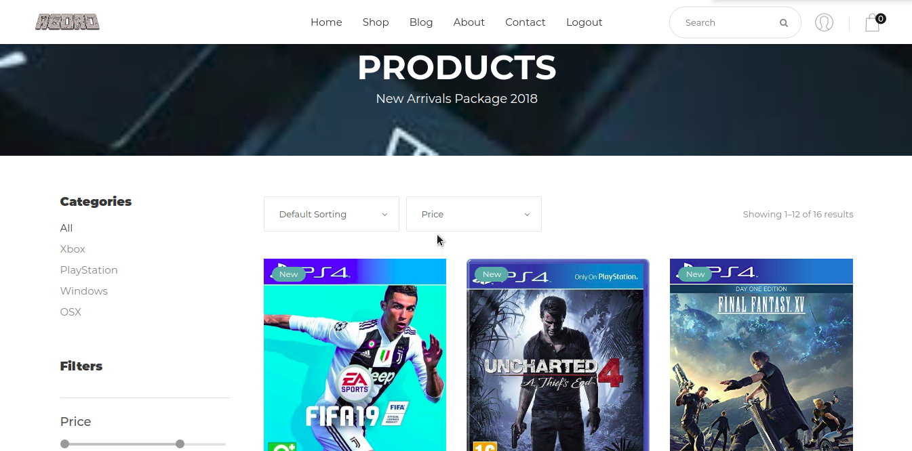
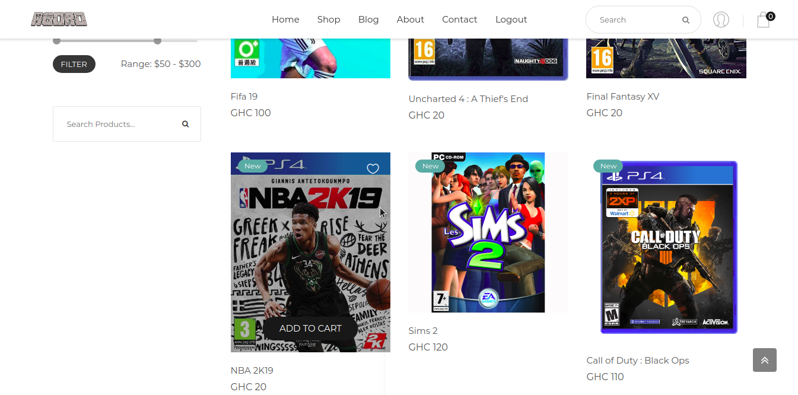

# E-Commerce Web Application with Admin Control View

## Motivation
This web application was built as part of a team project to create an E-commerce platform, complete with Admin functions such as adding, removing and updating products
for a local game vendor.

## Built with
- HTML, CSS, JavaScript
- PHP for Server Side Scriptiong
- MySQL for Database Storage

## Screenshots

##### Admin Login Page

##### Admin Dashboard Page

##### View Products Page

##### View Customers Page

##### Editing Available Brands Page

##### Editing and Viewing Previous Blogs

##### Client Homepage Page

##### Client Products Page1

##### Client Products Page2

